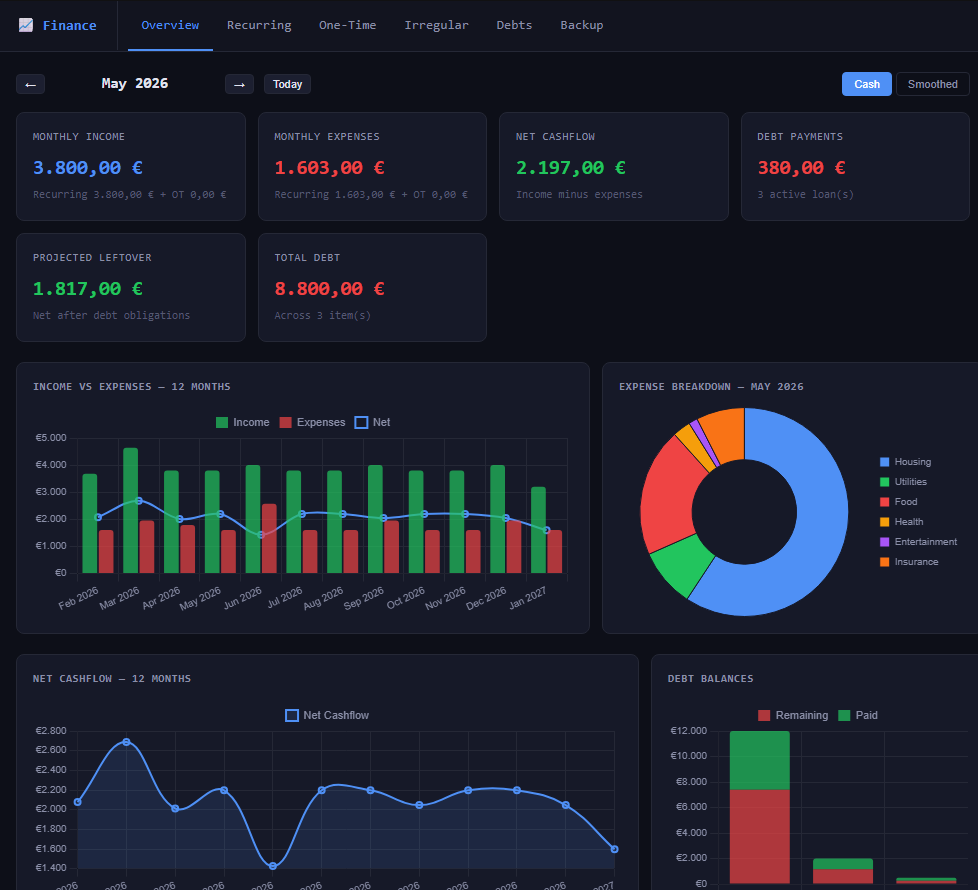

# Finance Dashboard

> [!TIP]
> This tool is actively maintained as a private personal finance utility. Feature requests and bug reports are welcome via GitHub Issues and will be reviewed within 1–3 weeks.

> [!WARNING]
> ⚠️ CAUTION: This repository contains code developed with the assistance of Artificial Intelligence (AI). While functional, AI-generated code can introduce hidden bugs, security vulnerabilities, or logic flaws that may not be immediately apparent. Please thoroughly review, audit, and test all files in an isolated development environment before deployment, as this software is provided as-is and used entirely at your own risk.

## 🚀 Introduction

Finance Dashboard is a private, browser-based personal finance manager built as a single self-contained HTML file — no server, no login, no activity logging, no backend. It runs entirely in the browser with no dependencies beyond jQuery and Chart.js loaded from CDN.

The dashboard is designed around a clear financial overview: track what comes in, what goes out, what repeats, what is upcoming, and what debt exists. Data lives entirely in memory during use and can be exported as a clean JSON file and re-imported at any time — giving full manual control over persistence without any third-party storage.

It is intended as a compact, data-dense tool for one person to maintain a clear picture of their monthly finances across recurring items, one-time events, irregular obligations, and outstanding debts.

---

## 🔥 Features

A focused feature set covering all major personal finance tracking categories with live charts and full data portability.

### 📥 Recurring Income & Expenses

Two editable tables — one for recurring income, one for recurring expenses — each with per-row payment day, amount, name, description, optional start date, and optional end date. Entries past their end date are marked **Expired** but remain visible for historical context. Only active entries are counted in calculations.

### 💸 One-Time Payments

Separate tables for one-time income and one-time expenses. Each entry has a specific date, amount, category, name, and description. One-time entries affect only the month matching their date and appear in the upcoming payment list for that month.

### 🔄 Irregular Payments

A dedicated table for non-monthly recurring items such as yearly insurance, quarterly tax advances, or custom every-N-months payments. The app projects these values into the correct months for charts and summaries. Supports **monthly**, **quarterly**, **yearly**, and **custom** intervals. Supports both income and expense types.

### 🏦 Loans & Debts

Track loans, credit card balances, and private debts with current balance, original amount, minimum monthly payment, interest rate, lender name, payment day, and optional end date. A progress bar shows how much of each debt has been paid off. Dashboard KPIs surface total debt and total monthly debt obligations.

### 📊 Live Charts

All charts update automatically on every data change.

| Chart | Type | Description |
|---|---|---|
| Income vs Expenses | Mixed bar + line | 12-month view of income bars, expense bars, and net cashflow line |
| Expense Breakdown | Doughnut | Current month expenses split by category |
| Net Cashflow Trend | Line (filled) | 12-month net cashflow with smoothed curve |
| Debt Balances | Stacked bar | Remaining vs paid amount per debt item |

### 🗓️ Monthly Navigator

Step through any past or future month with Previous / Next / Today controls. All KPI cards, the upcoming payment list, and the expense breakdown chart update to reflect the selected month. The 12-month charts always center around the current selection (3 months before, 8 months ahead).

### 📈 Cash vs Smoothed View

Toggle between **Cash View** (irregular payments appear only in their actual due month) and **Smoothed View** (irregular amounts normalized to a monthly share across the year) for planning purposes.

### 📋 Upcoming Payments

The overview tab shows a full list of every income and expense event in the selected month — recurring, one-time, irregular, and debt payments — sorted by day of the month.

### 💾 JSON Import / Export

All data can be exported as a timestamped `.json` file and re-imported later via file picker or paste. No localStorage dependency — the user controls when and where data is saved. Sample seed data can be loaded at any time and cleared with one click.

### ✏️ Full Table CRUD

Every table supports inline Add, Edit, and Delete with a modal form. Inputs are validated before saving. Delete requires a confirmation step. All tables support live search/filter by name, category, or description, and column sort on key fields.

---

## 🗒️ Requirements

No server-side requirements. The dashboard runs entirely in the browser.

| Requirement | Value |
|---|---|
| Modern Browser (Chrome, Firefox, Edge, Safari) | Required |
| JavaScript enabled | Required |
| Internet connection (CDN for jQuery + Chart.js) | Required on first load |
| Screen resolution | 1280×720 minimum recommended |

---

## 🛠️ Usage

### 🌐 GitHub Pages (Recommended)

The dashboard is hosted via GitHub Pages directly from the `docs/` folder of this repository. No installation required — open the link in any modern browser:

[https://bugfishtm.github.io/js-personal-finances/](https://bugfishtm.github.io/js-personal-finances/)

### 📄 Local File

Download `docs/index.html` from this repository and open it directly in your browser. Everything is self-contained in that single file.

---

## 📁 Repository Structure

| Path | Description |
|---|---|
| .git/ | Internal file, can be ignored. |
| .github/ | Internal file, can be ignored. |
| docs/ | Folder served by GitHub Pages. Contains the dashboard. |
| docs/index.html | The complete finance dashboard application — single self-contained HTML file. |
| [README.md](README.md) | This readme file. |
| [LICENSE.md](LICENSE.md) | License file. |

---

## 💬 Support Channels

If you encounter any issues or have questions while using this software, feel free to contact us:

- **GitHub Issues** is the main platform for reporting bugs, asking questions, or submitting feature requests: [https://github.com/bugfishtm/js-personal-finances/issues](https://github.com/bugfishtm/js-personal-finances/issues)
- **Discord Community** is available for live discussions, support, and connecting with other users: [Join us on Discord](https://discord.com/invite/xCj7AEMmye)
- **Email support** is recommended only for urgent security-related issues: [security@bugfish.eu](mailto:security@bugfish.eu)

---

## 📢 Spread the Word

Help us grow by sharing this project with others! You can:

* **Tweet about it** – Share your thoughts on [Twitter/X](https://twitter.com) and link us!
* **Post on LinkedIn** – Let your professional network know about this project on [LinkedIn](https://www.linkedin.com).
* **Share on Reddit** – Talk about it in relevant subreddits like [r/personalfinance](https://www.reddit.com/r/personalfinance/) or [r/opensource](https://www.reddit.com/r/opensource/).
* **Tell Your Community** – Spread the word in Discord servers, Slack groups, and forums.

---

## 🌱 Contributing to the Project

Thank you for your interest in this project.

At this time, this repository is **not open for external contributions**.
Please do **not** submit pull requests or patches.

- Pull requests from external contributors are not accepted.
- Any unsolicited pull requests will be closed without review.
- All code in this repository is maintained by the project owner.
- By design, no third‑party code will be merged into this project via GitHub.

If you encounter a bug or have an enhancement suggestion, please check the "Issues" section of our GitHub repository or visit our official website for guidance before beginning any work on it.

---

## 🤝 Community Guidelines

We're focused on developing innovative solutions and advancing technology. By being part of this, you contribute to our progress.

Positive guidelines include being kind, empathetic, and respectful in all interactions. It is important to engage thoughtfully and offer constructive, solution-oriented feedback. Fostering an environment of collaboration, support, and mutual respect is essential.

Unacceptable behaviors include harassment, hate speech, or offensive language. Personal attacks, discrimination, or any form of bullying are not tolerated. Sharing private or sensitive information without explicit consent is strictly prohibited.

Together, we can partner to achieve common goals by following guidelines designed to promote effective collaboration and positive teamwork.

---

## 🛡️ Security Policy

I take security seriously and appreciate responsible disclosure. If you discover a vulnerability, please follow these steps:

- **Do not** report it via public GitHub issues or discussions. Instead, please contact the [security@bugfish.eu](mailto:security@bugfish.eu) email address directly.
- Provide as much detail as possible, including a description of the issue, steps to reproduce it, and its potential impact.

I aim to acknowledge reports within **2–4 weeks** and will update you on our progress once the issue is verified and addressed.

This software is provided as-is, without any guarantees of security, reliability, or fitness for any particular purpose. We do not take responsibility for any damage, data loss, security breaches, or other issues that may arise from using this software. By using this software, you agree that We are not liable for any direct, indirect, incidental, or consequential damages. Use it at your own risk.

---

## 📜 License Information

The license for this software can be found in the [LICENSE.md](LICENSE.md) file. The software may also include additional licensed software or libraries.

🐟 Bugfish